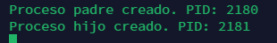
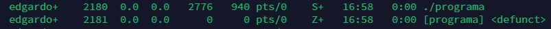

1. **Diferencia entre Scheduling Permisivo y No Permisivo**:
   - **Scheduling Permisivo**: En este tipo de programación, un proceso en ejecución puede ser interrumpido por el sistema operativo para permitir que otro proceso se ejecute. Esto significa que el sistema operativo tiene la facultad de decidir cuándo cambiar de un proceso a otro, incluso si el proceso actual no ha completado su ejecución.
   - **Scheduling No Permisivo**: En este tipo de programación, un proceso en ejecución no puede ser interrumpido por el sistema operativo. Esto implica que el proceso actual debe liberar voluntariamente el procesador antes de que otro proceso pueda ejecutarse. No hay intervención del sistema operativo para cambiar de un proceso a otro.

2. **Algoritmo de Scheduling que podría provocar un bloqueo indefinido**:
   - El algoritmo de **Round Robin** podría provocar un bloqueo indefinido. Esto podría ocurrir si un proceso se bloquea o entra en un estado de espera prolongado mientras está en la cola de listos para ejecución. Dado que Round Robin asigna un tiempo de CPU fijo a cada proceso en la cola de listos y alterna entre ellos, si un proceso no libera la CPU (por ejemplo, debido a un bloqueo o espera de entrada/salida), otros procesos podrían no ejecutarse nunca si el proceso bloqueado nunca libera la CPU.

3. **Probabilidades de cambios de contexto voluntarios y no voluntarios según el tipo de programa**:
   - **I/O-bound**: Este tipo de programa tiene más probabilidades de tener cambios de contexto voluntarios. Dado que los programas I/O-bound realizan más operaciones de entrada/salida que de CPU, a menudo liberan voluntariamente el procesador mientras esperan que se completen las operaciones de entrada/salida.
   - **CPU-bound**: Este tipo de programa tiene más probabilidades de tener cambios de contexto no voluntarios. Debido a que los programas CPU-bound realizan más uso de la CPU y menos operaciones de entrada/salida, es menos probable que liberen voluntariamente el procesador. Por lo tanto, es más probable que el cambio de contexto ocurra debido a que el sistema operativo intervenga para permitir que otros procesos se ejecuten.
  
4.	**Utilizando un sistema Linux, escriba un programa en C que cree un proceso hijo (fork) que finalmente se convierta en un proceso zombie. Este proceso zombie debe permanecer en el sistema durante al menos 10 segundos.**

```bash
#include <stdio.h>
#include <stdlib.h>
#include <unistd.h>
#include <sys/types.h>
#include <sys/wait.h>

int main() {
    pid_t child_pid;

    # Crear un proceso hijo
    child_pid = fork();

    if (child_pid < 0) {
        # Error al crear el proceso hijo
        perror("Error al crear el proceso hijo");
        exit(EXIT_FAILURE);
    } else if (child_pid == 0) {
        printf("Proceso hijo creado. PID: %d\n", getpid());
        # El proceso hijo finaliza inmediatamente después de la creación
        exit(EXIT_SUCCESS);
    } else {
        printf("Proceso padre creado. PID: %d\n", getpid());
        # Esperar un tiempo para que el proceso hijo se convierta en un zombie
        sleep(10);
        
        printf("Proceso hijo ya es un zombie. Esperando para limpiarlo...\n");
        # Esperar a que el proceso hijo termine
        wait(NULL);
       
        printf("Proceso hijo limpiado. Saliendo del proceso padre.\n");
    }

    return 0;
}
```
### Creación


### Cambio de Estado
